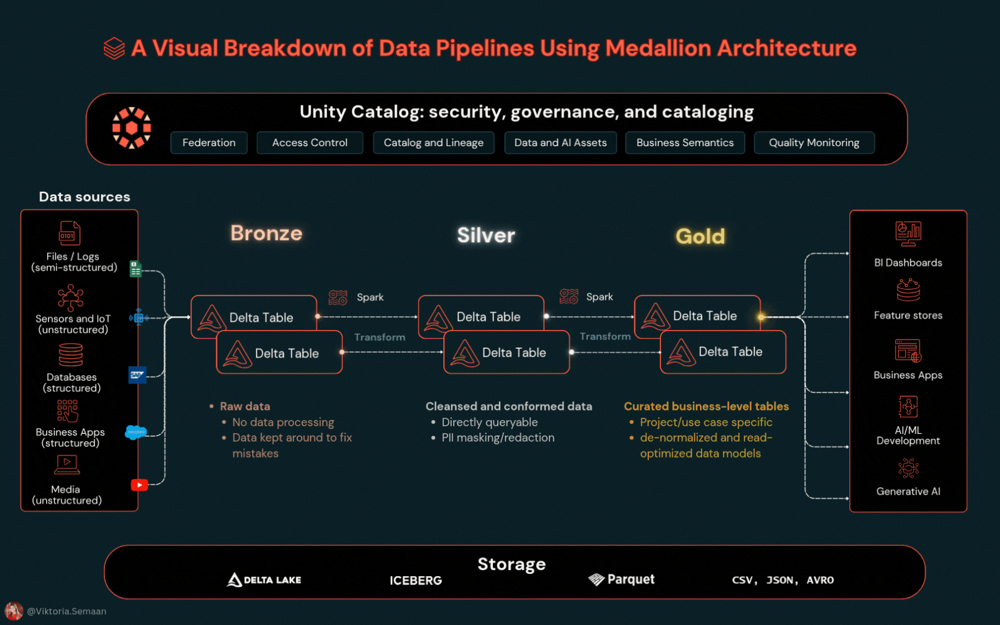

# 🚀 Data Engineering Portfolio

Real-world data engineering projects and tutorials covering Data & AI technologies.

## Projects

### 📊 [Lakehouse Tutorial](./lakehouse-tutorial/)
Your first complete data engineering project - build a production lakehouse from scratch using Apple Health data. Learn Spark, Delta Lake, and Unity Catalog fundamentals.

**Skills:** Medallion Architecture • Unity Catalog • Delta Lake • Apache Spark • SQL Optimization • Data Quality

*More projects coming soon...*

---

👋 **About:** This portfolio showcases hands-on data engineering projects designed for practitioners to advance their knowledge in the data & AI space. Each project includes complete tutorials, sample data, and production-ready patterns.

⭐ **Star this repo** if you find it helpful for your data engineering journey!

## 📄 License

This project is licensed under the MIT License - see the [LICENSE](LICENSE) file for details.

---

## 🔗 Connect

Let’s stay in touch and keep learning together!

---

**Contributing:** Found a bug or have an improvement? Feel free to open an issue or submit a pull request!
"# data_engineering_healthanalytics" 
