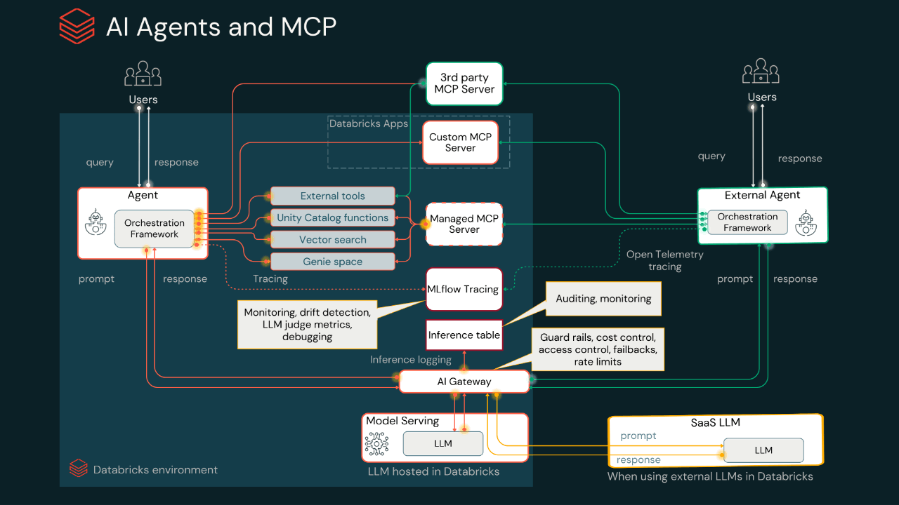
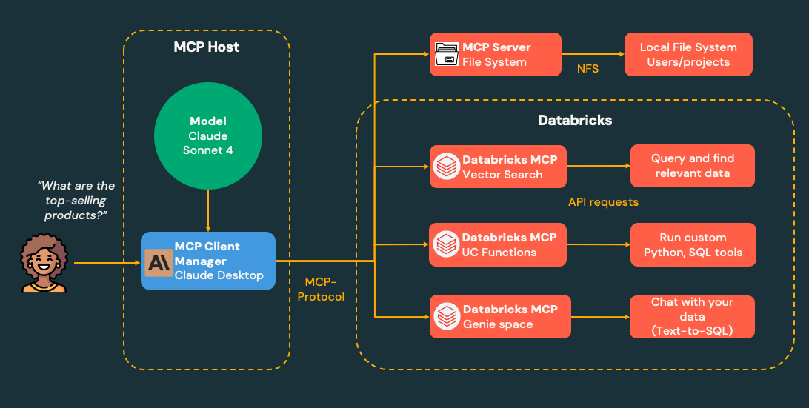

# 🚀 AI/BI Genie + Managed MCP Tutorial

**Learn how to set up AI/BI Genie and connect it to Claude Desktop for natural language data queries**

## 🎯 What You Will Learn

By completing this tutorial, you will:


- Create and configure AI/BI Genie for natural language data access
- Connect Genie to Claude Desktop via Managed MCP
- Query your data using natural language in Claude Desktop

## Overview

**AI/BI Genie** is Databricks' AI-powered data assistant that allows you to query your data using natural language. It understands your data schema, relationships, and can generate SQL queries, visualizations, and insights from text.

**MCP (Model Context Protocol)** is an open standard that allows AI assistants like Claude to connect to external tools and data sources.

Databricks provides 3 MCP options:
- **Managed MCP servers** 
- **External MCP servers** 
- **Custom MCP servers** 



In this tutorial, we focus only on **Managed MCP servers**.




## 📋 Prerequisites

- Databricks workspace (MCP is not available in Free Edition)
- Claude Desktop installed on your machine
- Basic familiarity with Python and SQL

## 🚀 1. Databricks Genie MCP - Step-by-Step Setup

### Optional Step 1: Create Lakehouse

1. Navigate to the `lakehouse-tutorial/` directory
2. Follow the instructions in `Health Analytics Demo.ipynb`
3. This will set up your Unity Catalog structure and create the foundational data layers


### Step 2: Create AI/BI Genie and Add Tables

1. **Navigate to AI/BI Genie**:
   - In your Databricks workspace, go to **Genie**
   - Click **"New"**
   - Select tables in Unity Catalog
   - Validate that it's working by asking a question

 - **Genie Documentation**: [AI/BI Genie Setup](https://docs.databricks.com/aws/en/genie/set-up)


### Step 3: Configure Claude Desktop with Managed MCP

1. **Create Personal Access Token (PAT) in Databricks**:
   - Go to User → Settings → Developer → Click Manage Acess tokens 
   - Click **"Generate new token"**. Select number of days Max is 730
   - Copy the generated token (you won't see it again!)

2. **Create Claude Configuration File**:
   - Open Claude Desktop, Claude → Settings → Developer → Edit Config `claude_desktop_config.json`
   - Add the following configuration. You can also use example prrovided in this repo.

```json
{
   "databricks-genie": {
      "command": "npx",
      "args": [
        "mcp-remote",
        "your-workspace.cloud.databricks.com/api/2.0/mcp/genie/<your-geniespace-id>>",
        "--header",
        "Authorization: Bearer <your-pat-token>"
      ]
    }
}

```
3. **Update Configuration**:
   - Replace `your-workspace.cloud.databricks.com` with your actual Databricks workspace URL
   - Replace `your-pat-token` with the PAT you generated
   - Replace `your-genie-space-id` with your actual Genie space ID

Documentation:
- **Databricks MCP Setup**: [MCP on Databricks](https://docs.databricks.com/aws/en/generative-ai/mcp/)
- **Claude MCP Tutorial** [Connect to Remote MCP](https://modelcontextprotocol.io/docs/tutorials/use-remote-mcp-server)

### Step 4: Validate the Connection

1. **Restart Claude Desktop** to load the new MCP configuration
2. **Test the Connection**:
   - Ask Claude: *"Connect to my Databricks Genie and show me my data summary"*
   - Claude should connect via MCP and be able to query your data


**Happy Data Querying! 🎉**
*Now you can ask Claude about your data in plain English!*

## 📚 Next Steps
Managed MCP Vecor Search and UC functions coming soon 🚀


## 🔧 Troubleshooting

### Common Issues:

1. **MCP Connection Failed**:
   - Verify your PAT is valid and not expired
   - Check that your Databricks workspace URL is correct
   - Ensure your workspace allows external connections (Free Edition doesn't support MCP)


## 🆘 Getting Help

- **Community Support**: [Databricks Community](https://community.databricks.com/)


